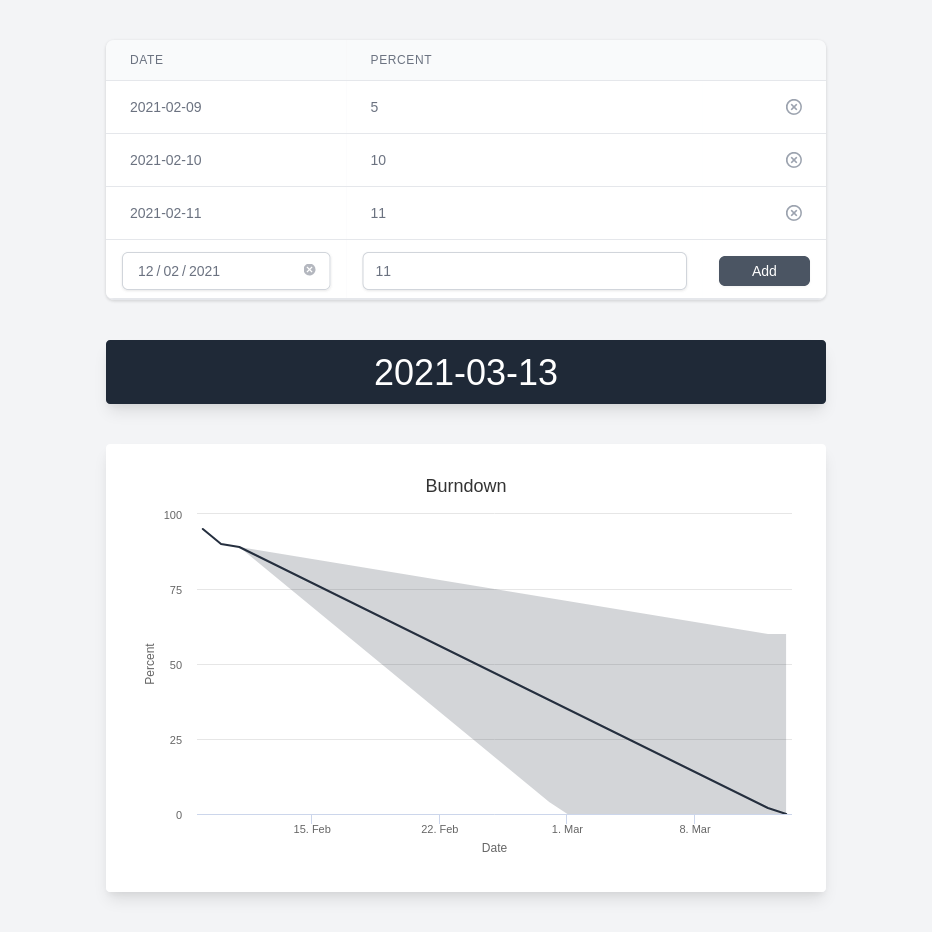

# Book Burndown

Single page application to track your reading progress and predict your completion date. All data is stored on the client in `localStorage`.



Linear regression code is stolen from https://dracoblue.net/dev/linear-least-squares-in-javascript/

## Project setup
```
yarn install
```

### Compiles and hot-reloads for development
```
yarn run serve
```

### Compiles and minifies for production
```
yarn run build
```

### Run tests
```
yarn run test
```
